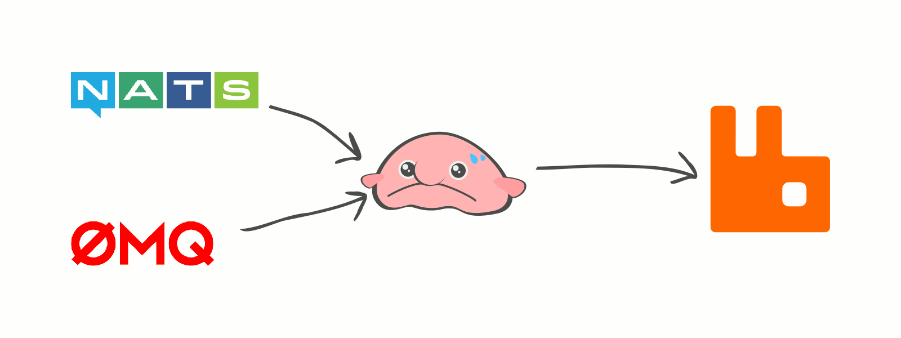

[![godoc for jeffail/benthos][1]][2]
[![goreportcard for jeffail/benthos][3]][4]

Benthos is a service that reads messages from any sources and writes them to any
sinks. It bridges services and tools together in ways that can simplify your
platform or reduce development time.

A range of optional buffer strategies are available, allowing you to select a
balance between latency, protection against back pressure and file based
persistence, or nothing at all (direct bridge).

## Supported Protocols



Currently supported input/output targets:

- [ZMQ4 (PUSH, PULL, SUB, PUB)][zmq]
- [Nanomsg/Scalability Protocols (PUSH, PULL, SUB, PUB)][nanomsg]
- [RabbitMQ (AMQP)][rabbitmq]
- [NSQ][nsq]
- [NATS][nats]
- [Kafka][kafka]
- HTTP 1.1 POST/GET
- STDIN/STDOUT
- File

Setting up multiple outputs or inputs is done by choosing a routing strategy
(fan in, fan out, round robin, etc.)

For a full and up to date list of all inputs, buffer options, and outputs you
can print them from the binary:

```
# Print inputs, buffers and output options
benthos --print-inputs --print-buffers --print-outputs | less
```

Mixing multiple part message protocols with single part can be done in different
ways, for more guidance [check out this doc.][5]

## Install

Build with Go:

``` shell
go get github.com/jeffail/benthos/cmd/...
```

Or, [download from here.](https://github.com/Jeffail/benthos/releases)

## Run

``` shell
benthos -c ./config.yaml
```

## Config

Benthos has inputs, optional processors, an optional buffer, and outputs, which
are all set in a single config file.

Check out the samples in [./config](config), or create a fully populated default
configuration file:

``` shell
benthos --print-yaml > config.yaml
benthos --print-json > config.json
```

The configuration file should contain a section for an input, output, and a
buffer. For example, if we wanted to output to a ZMQ4 push socket our output
section in a YAML config might look like this:

``` yaml
output:
  type: zmq4
  zmq4:
    addresses:
      - tcp://*:1234
    socket_type: PUSH
```

There are also configuration sections for logging and metrics, if you print an
example config you will see the available options.

For a list of metrics within Benthos [check out this spec][6].

## ZMQ4 Support

Benthos supports ZMQ4 for both data input and output. To add this you need to
install libzmq4 and use the compile time flag when building benthos:

``` shell
go install -tags "ZMQ4" ./cmd/...
```

## Vendoring

Benthos uses [dep][dep] for managing dependencies. To get started make sure you
have dep installed:

`go get -u github.com/golang/dep/cmd/dep`

And then run `dep ensure`. You can decrease the size of vendor by only storing
needed files with `dep prune`.

## Docker

There's a `Dockerfile` for creating a benthos docker image. This is built from
scratch and so you'll need to build without CGO (`CGO_ENABLED=0`) for your
benthos build to run within it. Create it like this:

``` shell
CGO_ENABLED=0 make docker
docker run --rm benthos
```

Then use the image:

``` shell
docker run --rm -v ~/benthos.yaml:/config.yaml -v /tmp/data:/data -p 8080:8080 \
	benthos -c /config.yaml
```

[1]: https://godoc.org/github.com/jeffail/benthos?status.svg
[2]: http://godoc.org/github.com/jeffail/benthos
[3]: https://goreportcard.com/badge/github.com/jeffail/benthos
[4]: https://goreportcard.com/report/jeffail/benthos
[5]: resources/docs/multipart.md
[6]: resources/docs/metrics.md
[dep]: https://github.com/golang/dep
[zmq]: http://zeromq.org/
[nanomsg]: http://nanomsg.org/
[rabbitmq]: https://www.rabbitmq.com/
[nsq]: http://nsq.io/
[nats]: http://nats.io/
[kafka]: https://kafka.apache.org/
