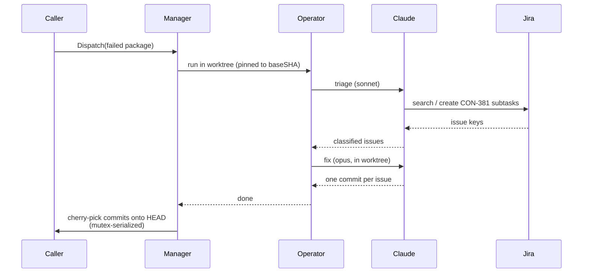

# llmfix

Self-healing for integration test failures. Runs Claude agents in parallel against failed Go packages, commits fixes in isolated git worktrees, and cherry-picks them back onto the caller's branch.

## Components

| File | Purpose |
|---|---|
| `manager.go` | Dispatches and supervises concurrent fix pipelines. Serializes cherry-picks. Persists agent status to `agents-status.json`. Recovers leftover worktrees. |
| `operator.go` | Runs the triage → fix pipeline for one package. |
| `claude.go` | Embeds prompts (`triage.md`, `fix.md`) and types the `claude -p` JSON envelope. |
| `git.go` | Worktree creation/cleanup and cherry-pick helpers. |
| `triage.md` | Prompt for the triage agent (model: `sonnet`). Classifies failures and syncs Jira CON-381 subtasks. |
| `fix.md` | Prompt for the fix agent (model: `opus`). Edits code, validates with `go test` + `golangci-lint`, and commits one issue per commit. |

## Flow

## Key invariants

- **Worktrees are pinned to `baseSHA`** so concurrent cherry-picks advancing `HEAD` don't pollute new worktrees.
- **Cherry-picks are mutex-serialized** across all goroutines — only one touches the caller's `HEAD` at a time.
- **One commit per issue.** The fix agent is instructed never to combine fixes.
- **Status is persisted** to `agents-status.json` so a re-run can retry agents that didn't reach `completed`.
- **Worktrees live under `.integration/worktree/<tag>`** and are recovered on startup if left over from a crashed run.

## Outputs

Under `<outputDir>/fix/`:

- `agents.log` — interleaved log of all agents, each line prefixed by slug.
- `agents-status.json` — persisted per-slug status (`dispatched` / `completed` / `failed`).
- `<tag>-triage.json` — triage agent's classified issues.
- `<tag>.jsonl` — fix agent's stream-json transcript.
- `<tag>.stderr` — fix agent's stderr.
