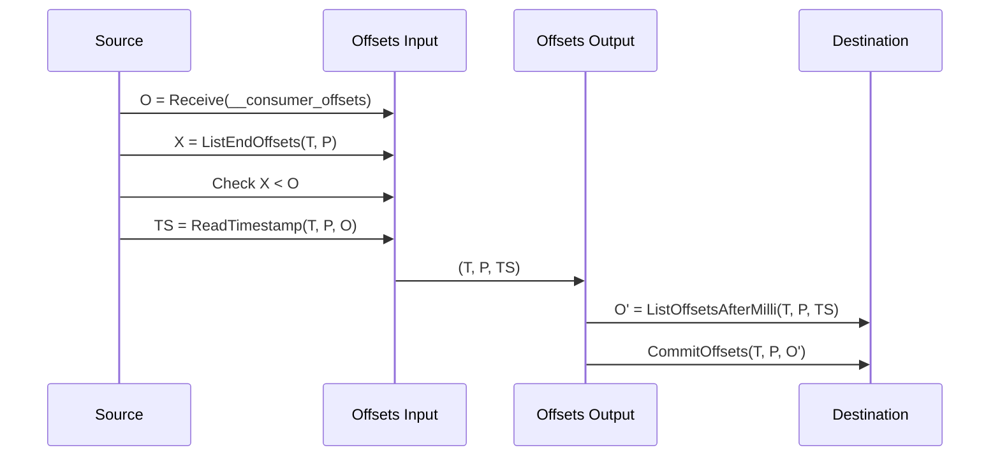
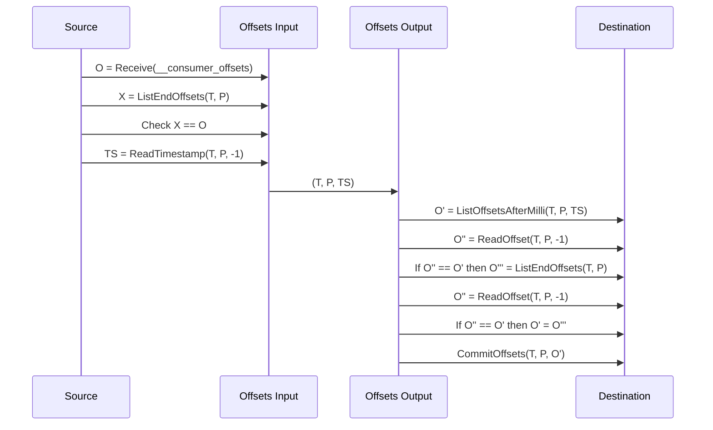
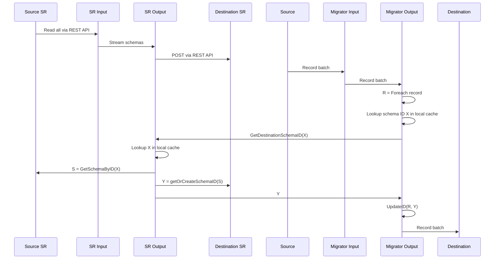

# Redpanda Migrator

Redpanda Migrator is a tool for migrating data (records, consumer group updates and schemas) between various Kafka clusters.

It guarantees at-least-once delivery semantics for Kafka records, so the destination cluster can end up receiving duplicate records.

Given this delivery guarantee model, record offsets in the destination cluster will differ from the source offsets. This forces us to perform record offset translation when migrating consumer group updates.

While more sophisticated approaches have been implemented (see [here](https://web.archive.org/web/20250112205959/https://blog.cloudera.com/a-look-inside-kafka-mirrormaker-2/) and [here](https://current.confluent.io/2024-sessions/mirrormaker-2s-offset-translation-isnt-exactly-once-and-thats-okay)), they are difficult to reason about and troubleshoot.

In Redpanda Migrator, we chose a simple record timestamp-based approach, where, each time we get an update on the `__consumer_offsets` topic in the source cluster, we first try to determine the timestamp of the consumed record which triggered this update and then use this timestamp to do another lookup in the destination cluster to determine the offset of the corresponding migrated record.

This approach requires that all topics which need to be migrated contain records which have monotonically-increasing timestamps, including duplicates.

## Sequence diagrams

### Consumer group offsets migration

Consumer group offsets are migrated independently from records and schemas.

1. Migrate a consumer group update for a record in topic `T` partition `P` located at an arbitrary offset `O` in the `[start, end)` interval in the Source cluster which translates to offset `O'` in the Destination cluster.

2. Migrate a consumer group update for the record at the end of topic `T` partition `P` with offset `O` in the Source cluster which translates to offset `O'` in the Destination cluster.

Note: `-1` is used to retrieve the last record offset from a topic.

### Record and schema migration

