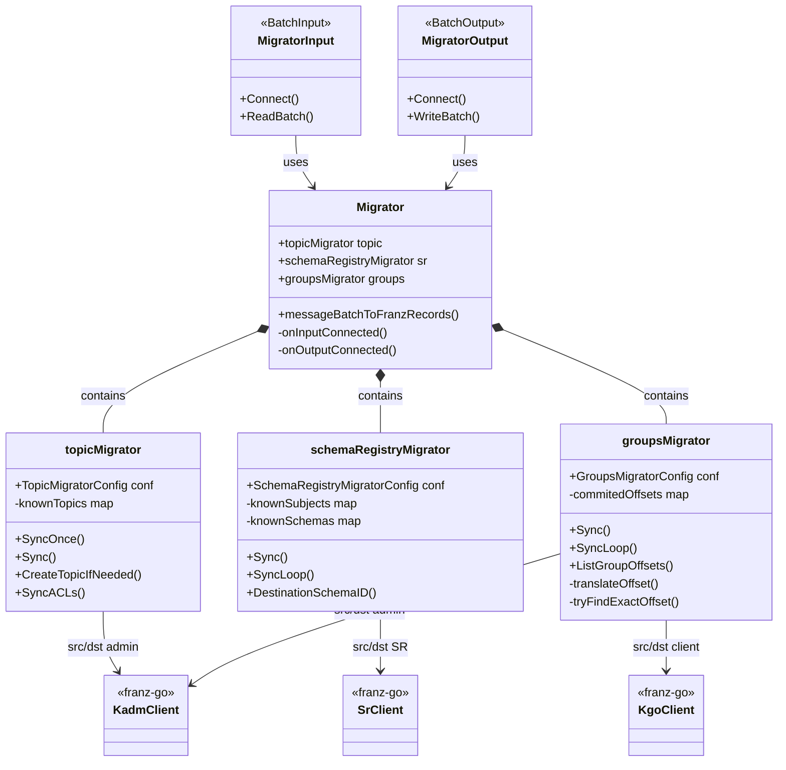
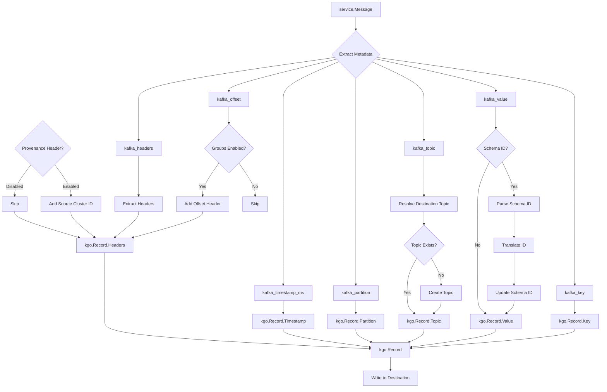
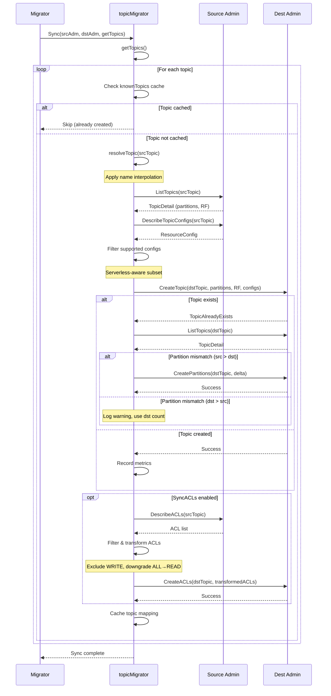
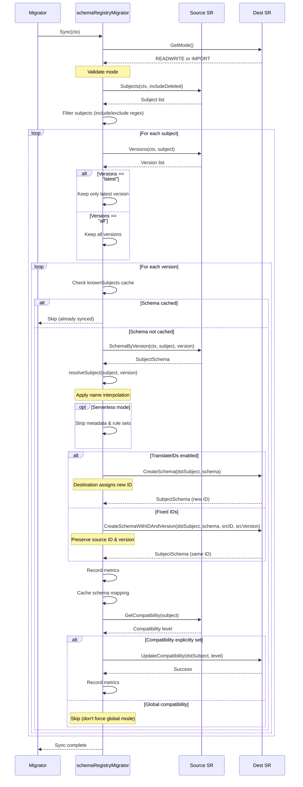
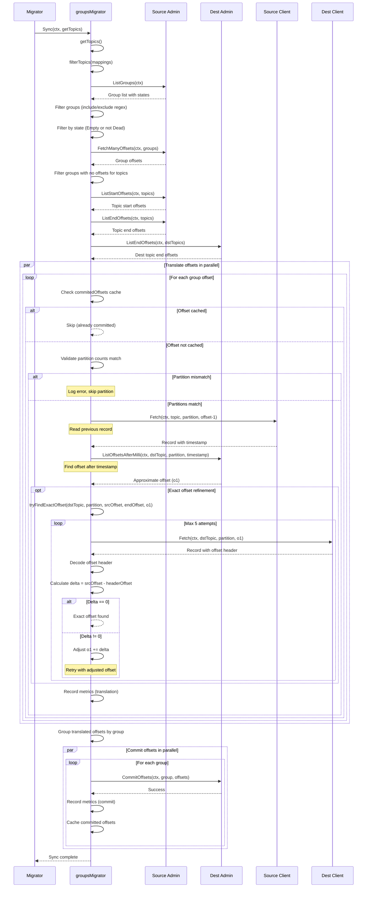

# Redpanda Unified Migrator

Comprehensive data migration system for Apache Kafka and Redpanda clusters, coordinating topics, schemas, and consumer groups.

## Architecture Overview

The unified migrator orchestrates three specialized migrators working in concert to provide complete cluster-to-cluster migration.



### Component Responsibilities

**Migrator** - Central coordinator
- Manages input/output lifecycle
- Transforms service messages to franz-go records
- Coordinates timing of sub-migrator operations
- Handles provenance headers and schema ID translation

**topicMigrator** - Topic infrastructure
- Resolves destination topic names via interpolation
- Creates topics with mirrored partition counts
- Copies supported configuration keys
- Optionally replicates ACLs with safety transforms

**schemaRegistryMigrator** - Schema synchronization
- Lists and filters subjects by regex patterns
- Copies schemas with ID translation or fixed IDs
- Propagates per-subject compatibility settings
- Runs one-shot or periodic sync loops

**groupsMigrator** - Consumer group offset translation
- Discovers groups filtered by name and state
- Translates offsets using timestamp correlation
- Refines translation with embedded offset headers
- Prevents offset rewind with caching

## Record Construction Pipeline

How input messages are transformed into franz-go records for destination cluster.



### Key Transformations

1. **Schema ID Translation** - When `translate_ids: true`, source schema IDs are mapped to destination IDs via schema registry lookup
2. **Topic Name Resolution** - Interpolated string resolves destination topic from source topic metadata
3. **Offset Header Injection** - Source offset embedded in record header for exact consumer group translation
4. **Provenance Tracking** - Source cluster ID added to prevent circular migration in bidirectional setups

## Topic Migrator Sync Flow

Topic creation and synchronization sequence.



### Topic Sync Characteristics

- **On-demand execution** - First message triggers initial sync, subsequent messages create topics as encountered
- **Idempotent operations** - Existing topics are validated, partitions increased if needed
- **Configuration filtering** - Only supported keys copied (serverless-aware subset)
- **ACL safety transforms** - WRITE excluded, ALL downgraded to READ

## Schema Registry Migrator Sync Flow

Schema and compatibility synchronization sequence.



### Schema Sync Characteristics

- **Initial sync on connect** - One sync when output connects
- **Optional periodic sync** - Background loop controlled by `interval` setting
- **On-demand sync** - Triggered when record has unknown schema ID
- **ID translation modes** - Create-or-reuse (translate) vs fixed IDs
- **Compatibility propagation** - Only when explicitly set per-subject

## Consumer Groups Migrator Sync Flow

Consumer group offset translation and commit sequence.



### Consumer Group Sync Characteristics

- **Periodic execution** - Background loop controlled by `interval` setting
- **State-based filtering** - Only Empty groups by default (configurable to include all non-Dead)
- **Timestamp-based translation** - Uses `ListOffsetsAfterMilli` for approximate offset
- **Exact offset refinement** - Reads destination records to find embedded source offset
- **No rewind guarantee** - Cached offsets prevent moving backwards
- **Parallel processing** - Translation and commit operations parallelized per group

### Offset Translation Algorithm

1. **Fetch previous record** - Read record at `srcOffset - 1` to get timestamp
2. **Approximate translation** - Use `ListOffsetsAfterMilli` to find offset after timestamp
3. **Exact refinement** - Iteratively read destination records and compare embedded source offset
4. **Delta adjustment** - Calculate `delta = srcOffset - embeddedOffset`, adjust by delta
5. **Convergence** - Repeat up to 5 times until exact offset found or bounds exceeded

## Execution Model

### Startup Sequence

1. **Input connects** - Source cluster metadata fetched, admin clients initialized
2. **Output connects** - Destination cluster metadata fetched, admin clients initialized
3. **Initial schema sync** - One-shot schema registry synchronization
4. **Start background loops** - Schema sync loop (optional), consumer groups sync loop

### Message Processing

1. **First message triggers topic sync** - All consumed topics created on demand
2. **Per-message operations** - Topic creation (if needed), schema ID translation (if enabled)
3. **Batch write** - Transformed records written to destination with preserved partitioning

### Background Operations

- **Schema sync loop** - Runs every `schema_registry.interval` (if > 0)
- **Consumer groups sync loop** - Runs every `consumer_groups.interval` (if > 0)
- **Independent execution** - Loops run concurrently with message processing

## Configuration Patterns

### Basic Migration

```yaml
input:
  redpanda_migrator:
    seed_brokers: ["source:9092"]
    topics: ["orders", "payments"]
    consumer_group: "migration"

output:
  redpanda_migrator:
    seed_brokers: ["destination:9092"]
    topic: ${! @kafka_topic }  # Preserve names
```

### Topic Name Transformation

```yaml
output:
  redpanda_migrator:
    topic: prod_${! @kafka_topic }  # Add prefix
```

### Schema Registry with ID Translation

```yaml
output:
  redpanda_migrator:
    schema_registry:
      url: "http://dest-registry:8081"
      translate_ids: true  # Create-or-reuse mode
      versions: all        # Migrate all versions
```

### Consumer Groups with Filtering

```yaml
output:
  redpanda_migrator:
    consumer_groups:
      interval: 1m
      include: ["app-.*"]      # Only app- prefixed groups
      exclude: ["migration"]   # Exclude migrator itself
      only_empty: true         # Only Empty state groups
```

### Serverless Mode

```yaml
output:
  redpanda_migrator:
    serverless: true  # Restrict configs to serverless subset
    schema_registry:
      url: "https://serverless.redpanda.com:8081"
      translate_ids: true
```

## Metrics

### Topic Migration

- `redpanda_migrator_topics_created_total` - Topics successfully created
- `redpanda_migrator_topic_create_errors_total` - Topic creation failures
- `redpanda_migrator_topic_create_latency_ns` - Topic creation latency

### Schema Registry Migration

- `redpanda_migrator_sr_schemas_created_total` - Schemas successfully created
- `redpanda_migrator_sr_schema_create_errors_total` - Schema creation failures
- `redpanda_migrator_sr_schema_create_latency_ns` - Schema creation latency
- `redpanda_migrator_sr_compatibility_updates_total` - Compatibility updates applied
- `redpanda_migrator_sr_compatibility_update_errors_total` - Compatibility update failures
- `redpanda_migrator_sr_compatibility_update_latency_ns` - Compatibility update latency

### Consumer Group Migration

Per-group metrics with `group` label:

- `redpanda_migrator_cg_offsets_translated_total` - Offsets successfully translated
- `redpanda_migrator_cg_offset_translation_errors_total` - Offset translation failures
- `redpanda_migrator_cg_offset_translation_latency_ns` - Offset translation latency
- `redpanda_migrator_cg_offsets_committed_total` - Offsets successfully committed
- `redpanda_migrator_cg_offset_commit_errors_total` - Offset commit failures
- `redpanda_migrator_cg_offset_commit_latency_ns` - Offset commit latency

### Consumer Lag

Per-partition metrics with `topic` and `partition` labels:

- `redpanda_lag` - Current consumer lag in messages

## Guarantees and Limitations

### Guarantees

- **Topic partition counts** - Destination topics created with matching partition counts
- **No offset rewind** - Consumer group offsets never moved backwards
- **ACL safety** - WRITE operations excluded, ALL downgraded to READ
- **Idempotent operations** - Repeated syncs are safe

### Limitations

- **Offset translation best-effort** - Skips partition if previous-offset timestamp unavailable
- **Partition count requirement** - Consumer group migration requires identical partition counts
- **Schema registry mode** - Destination must be in READWRITE or IMPORT mode
- **Exact offset dependency** - Requires offset header in destination records (added automatically)

## Advanced Features

### Bidirectional Migration

Provenance headers prevent circular migration:

```yaml
output:
  redpanda_migrator:
    provenance_header: "redpanda-migrator-provenance"  # Default
```

Records with provenance header matching destination cluster ID are skipped.

### ACL Replication

Safe ACL transforms for read-only migration:

```yaml
output:
  redpanda_migrator:
    sync_topic_acls: true
```

- Excludes `ALLOW WRITE` entries
- Downgrades `ALLOW ALL` to `ALLOW READ`
- Preserves resource pattern type and host filters

### Schema Normalization

Normalize schemas on create for consistency:

```yaml
output:
  redpanda_migrator:
    schema_registry:
      normalize: true
```

### Exact Offset Translation

Embedded offset headers enable exact consumer group parking:

- Automatically added to destination records when consumer groups enabled
- Used by `tryFindExactOffset` to refine timestamp-based translation
- Handles non-monotonic timestamps and sub-millisecond precision

## Testing

The migrator has comprehensive test coverage across unit, integration, and soak test categories.

### Test Organization

```
migrator/
├── *_test.go                              # Unit tests
├── *_integration_test.go                  # Integration tests
└── integration_soak_test.go               # Long-running soak test
```

### Unit Tests

**Configuration & Validation** - `migrator_test.go`
- Output lint rules validation (key, partitioner, partition, timestamp fields)

**Data Conversion** - `conv_test.go`
- Topic name mapping with identical and transformed names

**Schema Registry** - `migrator_schema_registry_test.go`
- Version parsing (latest, all, invalid inputs)
- Schema equality comparison (type, schema string, references)

**Consumer Groups** - `migrator_groups_test.go`
- Topic extraction from group offsets

### Integration Tests

**End-to-End Migration** - `integration_test.go`
- Single partition migration with schema registry
- Malformed schema ID handling
- Multi-partition with consumer groups
- Kafka input compatibility with franz consumer groups
- Real Confluent to Redpanda Serverless migration (manual)
- Bidirectional migration with provenance headers
- Exact offset translation for non-monotonic timestamps

**Topic Migration** - `migrator_topic_integration_test.go`
- Topic configuration synchronization
- ACL replication with safety transforms
- Idempotent sync operations
- Partition growth handling

**Schema Registry Migration** - `migrator_schema_registry_integration_test.go`
- Subject listing with include/exclude filters
- Name resolution with interpolation
- Version selection (latest vs all)
- ID translation modes (translate vs fixed)
- ID reuse with identical schemas
- Schema normalization
- Idempotent sync operations
- Compatibility level propagation

**Consumer Groups Migration** - `migrator_groups_integration_test.go`
- Group offset listing with filtering
- Record timestamp reading
- Multi-node cluster timestamp reading (manual)
- Full offset sync with translation and commit

### Soak Testing

**Long-Running Stability** - `integration_soak_test.go`
- Continuous migration under sustained load
- Configurable duration, message rate, and topic count
- Memory and CPU profiling support
- Validates stability over extended periods

### Test Infrastructure

**Embedded Clusters** - `integration_helpers_test.go`
- Dockerized Redpanda clusters with schema registry
- Automatic cleanup and resource management
- Reusable test fixtures for source/destination pairs

**Test Characteristics**
- All integration tests use real Redpanda clusters via Docker
- Tests validate actual Kafka protocol interactions
- Schema registry tests use real schema registry instances
- Consumer group tests verify offset commit behavior
- Eventual consistency handled with `assert.Eventually`

### Coverage Highlights

**Critical Paths Tested**
- ✅ Topic creation with partition mirroring
- ✅ Schema ID translation and fixed ID modes
- ✅ Consumer group offset translation (timestamp-based)
- ✅ Exact offset refinement with embedded headers
- ✅ ACL replication with safety transforms
- ✅ Provenance header circular migration prevention
- ✅ Idempotent operations (topics, schemas, consumer groups)
- ✅ Error handling and edge cases

**Edge Cases Covered**
- Empty inputs and nil values
- Malformed schema IDs
- Partition count mismatches
- Non-monotonic timestamps
- Sub-millisecond timestamp precision
- Concurrent operations
- Schema ID conflicts

## Implementation Notes

### Caching Strategy

- **Topics** - `knownTopics` map prevents redundant creation attempts
- **Schemas** - `knownSubjects` and `knownSchemas` maps prevent redundant schema operations
- **Consumer groups** - `commitedOffsets` map prevents offset rewind

### Concurrency Model

- **Message processing** - Single in-flight batch (maxInFlight = 1) for ordering
- **Offset translation** - Parallel per partition within sync iteration
- **Offset commit** - Parallel per group within sync iteration
- **Background loops** - Independent goroutines for schema and consumer group sync

### Error Handling

- **Topic creation** - Errors fail message batch, retry on next batch
- **Schema sync** - Errors logged, retry on next sync iteration
- **Consumer group sync** - Errors logged, retry on next sync iteration
- **Offset translation** - Partition skipped on error, other partitions continue
